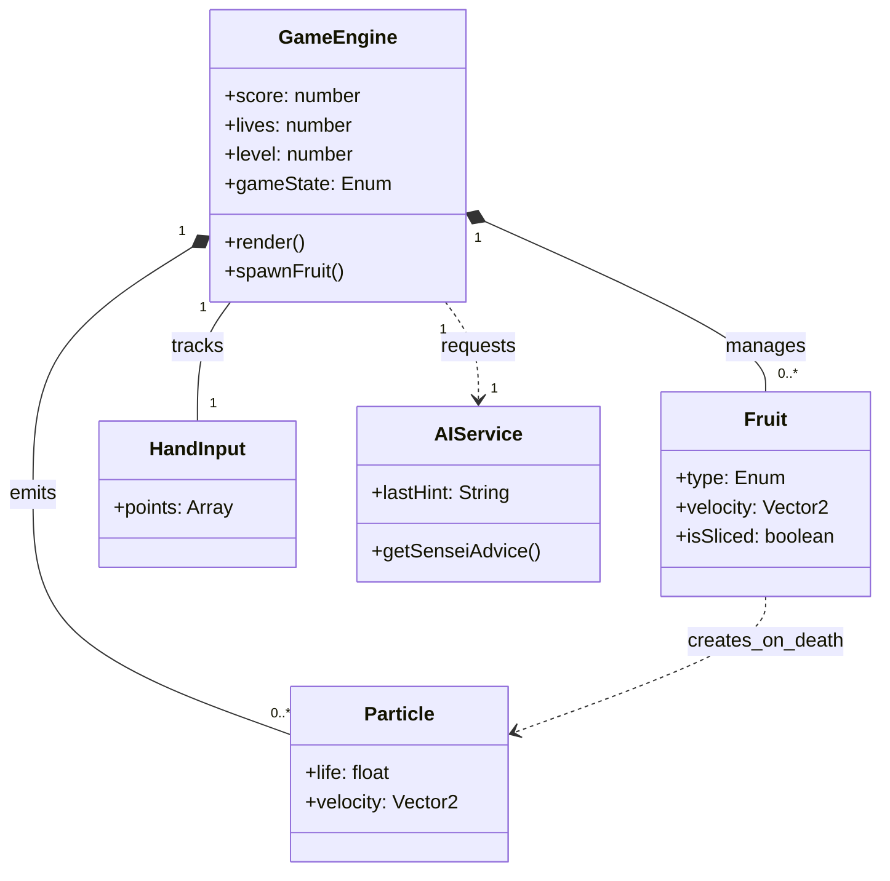

# Data Structures & Game Entities

Since **Abang Fruit Ninja** is a client-side application without a persistent database, this document serves as the **Entity Definition Diagram**. It maps out the objects existing in the application's memory heap during runtime.

## 1. Game Entities

These entities are managed via `useRef` arrays in the main game component.

### 1.1 `Fruit` (The Target)
The core interactive object.
| Property | Type | Description |
| :--- | :--- | :--- |
| `id` | `string` | Unique UUID (Math.random generated). |
| `type` | `FruitType` | Enum: `guava`, `mango`, `pineapple`, `sweet_mango`, `bomb`. |
| `x`, `y` | `number` | Position on canvas. |
| `vx`, `vy` | `number` | Velocity vector. |
| `radius` | `number` | Hitbox size. |
| `rotation` | `number` | Current rotation in radians. |
| `isSliced` | `boolean` | State flag. If true, renders split sprites. |

### 1.2 `Particle` (Visual FX)
Generated upon slicing or explosion.
| Property | Type | Description |
| :--- | :--- | :--- |
| `x`, `y` | `number` | Position. |
| `vx`, `vy` | `number` | Velocity. |
| `life` | `number` | 1.0 to 0.0. Determines opacity/removal. |
| `color` | `string` | Hex code based on parent fruit flesh color. |
| `wait` | `number` | (Optional) Delay ticks for "mashing" effect. |

### 1.3 `BladeTrail` (Input)
A queue of points representing the user's hand path.
| Property | Type | Description |
| :--- | :--- | :--- |
| `x`, `y` | `number` | Screen coordinates. |
| `timestamp` | `number` | (Implicit) Order in array determines age. |

## 2. Configuration Objects

Static configuration dictionaries used to determine game balance and visuals.

### 2.1 `FRUIT_CONFIG`
| Key (FruitType) | Hex | Points | Radius | FleshColor |
| :--- | :--- | :--- | :--- | :--- |
| `guava` | `#A4C639` | 10 | 42 | `#F06292` |
| `mango` | `#FFD54F` | 20 | 48 | `#FFB300` |
| `pineapple` | `#FBC02D` | 50 | 60 | `#FFF176` |
| `sweet_mango` | `#FF7043` | 150 | 52 | `#FF9800` |
| `bomb` | `#1a1a1a` | -100 | 38 | `#D32F2F` |

## 3. AI Data Models

Data structures used for the API request/response cycle.

### 3.1 `AiResponse` (Wrapper)
```typescript
interface AiResponse {
  hint: StrategicHint;
  debug: DebugInfo;
}
```

### 3.2 `StrategicHint` (The Logic)
The JSON schema expected from Gemini 3 Flash.
| Field | Type | Description |
| :--- | :--- | :--- |
| `message` | `string` | The user-facing text (e.g., "Focus on the Pineapple!"). |
| `rationale` | `string` | The "Why" behind the advice. |
| `priorityFruit` | `FruitType` | The fruit ID to highlight in UI. |
| `techniqueTip` | `string` | Advice on hand movement (e.g., "Wider strokes"). |

### 3.3 `DebugInfo` (Telemetry)
| Field | Type | Description |
| :--- | :--- | :--- |
| `latency` | `number` | API roundtrip time in ms. |
| `rawResponse` | `string` | Unparsed string from LLM. |
| `timestamp` | `string` | Local time of request. |

## 4. State Relationship Map


